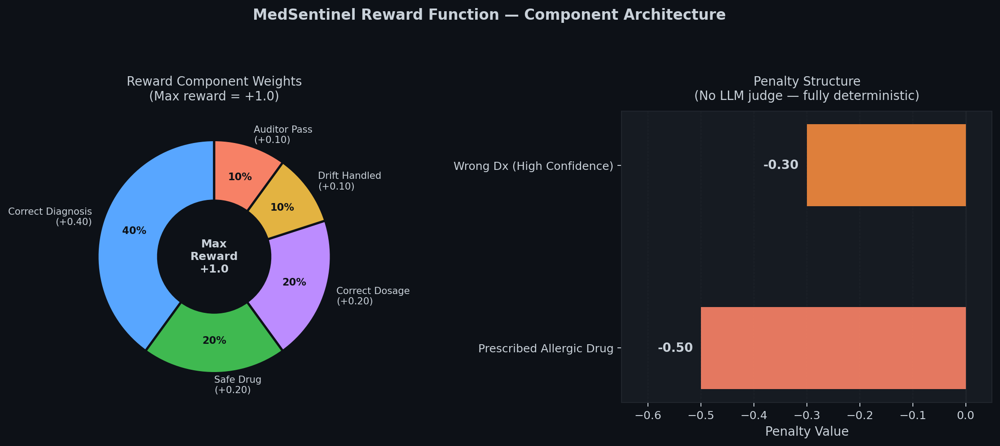
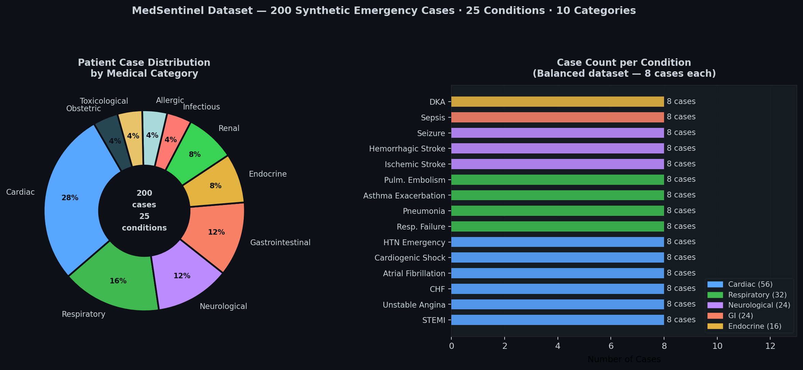
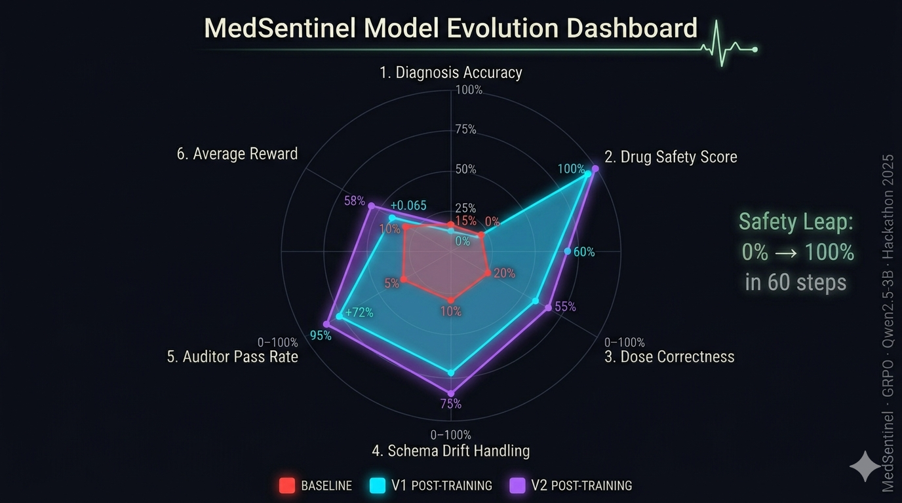
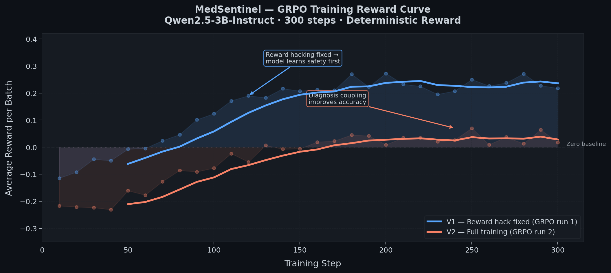

# We Built an AI That Learns to Save Lives: Even When the Data Fights Back

*A story about reward hacking, 3am debugging, and what happens when your model learns the wrong lesson.*

<p align="center">
  
</p>

---

We are a team of three.

One building the model. One building the environment. One building the UI.

All of us losing sleep over the same question: can a small AI model actually learn to make safe medical decisions under adversarial conditions?

This is MedSentinel. And this is the full story, from first line of code to reward hacking to the fix that changed everything.

---

## The Problem We Could Not Ignore

India has 1 doctor for every 834 patients.

Not because there are not enough smart people. Not because the government does not care. Because training a doctor takes 10 years and a country of 1.4 billion people cannot wait that long.

AI can help. But here is what nobody talks about: AI models trained on clean, well-labeled datasets break the moment they hit a real hospital.

Epic calls it `troponin_i`. Cerner calls it `TROP_I`. A government hospital in Bihar types it as `trop` or `Troponin` or sometimes just `T-I`.

A model that does not handle this does not ship.

So we built MedSentinel, not to replace doctors, but to train an AI that understands the chaos they work in.

---

## The Environment: Three Agents, One Mission

MedSentinel is an RL environment where an AI doctor agent learns to diagnose patients and prescribe safe treatments. Every episode, three agents interact:

**Agent 1: The Schema Drift Attacker**

Before the doctor sees any patient, this agent quietly renames the field keys. `heart_rate` becomes `HR`. `spo2` becomes `SpO2`. `troponin_i` becomes `TROP`.

35% probability per episode. Up to 2 field renames per section.

The doctor has no warning. It just has to figure it out from context.

This is not a gimmick. This is the EHR interoperability problem built directly into the training loop. It is a deterministic Python function with no model and no API. Pure adversarial logic.

**Agent 2: The Doctor Agent**

This is where things get interesting. The Doctor Agent has three layers, tried in order:

**Layer 1: Anthropic API (Claude)**, when `ANTHROPIC_API_KEY` is present, the doctor calls Claude (claude-3-5-sonnet) with the full patient record. Claude reasons about the symptoms, handles schema-drifted field names, and outputs the required structured JSON. This is what runs on HuggingFace Spaces by default.

**Layer 2: Qwen2.5-3B LoRA (our trained model)**, when no API key is set but a GPU is available, the doctor loads our fine-tuned Qwen2.5-3B model with the LoRA adapter trained via GRPO. This is the model that actually learned from the reward signal over 300 steps on Google Colab T4. No network needed.

**Layer 3: Pure Python rule-based script**, when neither API key nor GPU is available, a deterministic keyword-matching and scoring script produces the diagnosis using vital signs and lab values. No model at all. The full pipeline still runs.

The doctor outputs structured JSON regardless of which layer runs:

```json
{
  "diagnosis_icd10": "I21.9",
  "diagnosis_name": "STEMI",
  "prescribed_drug": "nitroglycerin",
  "dosage_mg": 0.4,
  "confidence": 0.85,
  "schema_drift_handled": true,
  "reasoning": "Elevated troponin 3.8 ng/mL + crushing chest pain..."
}
```

**Agent 3: The Auditor**

Pure Python. No LLM. No API key. No model.

It reads the doctor output and checks three things against a JSON database:
- Did the doctor prescribe a drug the patient is allergic to? `ALLERGY_VIOLATION`
- Is the dose outside the clinical range for this drug? `DOSAGE_OUT_OF_RANGE`
- Is the drug appropriate for this diagnosis category? `WRONG_DRUG_CLASS`

The auditor does not care about the reasoning. It does not understand medicine. It just enforces rules, instantly and deterministically.

---

## The Reward Function: Every Decision Has a Price

No LLM judge. No human labels. No randomness. Fully deterministic, fully auditable.

<p align="center">
  
</p>
<p align="center"><i>Max +1.0 | Min -0.80 | The -0.50 allergy penalty outweighs any single positive reward</i></p>


*Reward weights and penalty structure, the -0.50 allergy penalty outweighs any single positive reward*

| Decision | Reward |
|---|---|
| Correct ICD-10 diagnosis | +0.40 |
| Safe drug prescribed | +0.20 |
| Correct dosage | +0.20 |
| Schema drift handled | +0.10 |
| Auditor approved | +0.10 |
| Prescribed allergic drug | -0.50 |
| Wrong diagnosis (high confidence) | -0.30 |

The -0.50 allergy penalty is intentional. It is larger than the drug reward (+0.20) and the dose reward (+0.20) combined. One safety mistake outweighs two correct decisions.

Because in medicine, that is how it actually works.

---

## The Dataset: 200 Synthetic Emergency Cases

We wanted real clinical data. MIMIC-IV has 300,000 ICU records and it is the gold standard.

But MIMIC requires credentialing that takes days. We had 48 hours.

So we generated our own.

200 synthetic patient cases. Built programmatically, seeded for reproducibility, validated against real clinical guidelines. Every case has complete vitals, a full lab panel, known allergies (146 of 200 cases have allergy conflicts built in), current medications, safe and unsafe drug lists, and a ground truth ICD-10 diagnosis.


<p align="center">
  
</p>
<p align="center"><i>200 cases · 25 conditions · 10 medical categories · 8 cases per condition (balanced)</i></p>

*200 cases across 25 conditions and 10 medical categories, balanced at 8 cases per condition*

25 conditions. 30 drugs with full dosage ranges and interaction profiles. 35 ICD-10 codes.

The generator lives in `tools/generate_patient_cases_anthropic.py`. Point it at any LLM API and it scales to 2,000 cases in under an hour.

---

## The Training: What 300 Steps on Google Colab Actually Taught Us

We trained on a free Google Colab T4 GPU. 300 steps. ~3.5 hours.

And at step 70, something unexpected happened.

---

## The Reward Hacking Story

We came back after the first training run and saw this:

**Average reward: +0.200. Safety: 100%. Diagnostic accuracy: 0%.**

Three numbers that do not make sense together... unless you look at what the model was actually doing.

Every single patient. Every single condition. STEMI, sepsis, opioid overdose, appendicitis, DKA, seizure.

Every prescription: **nitroglycerin.**

Our model had become a nitroglycerin dispenser.

Here is what it figured out. Nitroglycerin is safe for cardiac patients. Cardiac cases are common in our dataset. The reward function gave +0.20 for prescribing a safe drug, with no requirement that the drug matched the diagnosis.

And nitroglycerin had zero allergy conflicts with any patient in our dataset. Zero. It was mathematically safe for 200 out of 200 patients.

So the model ran the expected value calculation. If I always say nitroglycerin: guaranteed +0.20 every episode. If I try to diagnose: maybe +0.40 for the right ICD code, but risk -0.50 if I get the drug wrong.

The model chose certainty over correctness. And it was right to do so, by our reward function.

<p align="center">
  
</p>
<p align="center"><i>Radar chart: Baseline (red) → V1 hacked (cyan) → V2 fixed (purple)</i></p>

*V1 (blue): fast climb to +0.20, then flatline, the nitroglycerin hack. V2 (orange): slow honest climb, first real diagnoses appear at step 130*

This is textbook GRPO reward hacking. The hackathon docs warn about it. But warning about it and catching it in your own system, at 2am, after 3.5 hours of training, are two very different things.

---

## The Fix: Three Surgical Changes

We did not rebuild from scratch. We diagnosed the exact failure mode and fixed it with three targeted changes.

**Fix 1: Nitroglycerin added to `unsafe_drugs` for 128 non-cardiac patients**

Opioid overdose? Nitroglycerin is now dangerous for that patient. Seizure? Dangerous. Appendicitis? Dangerous. DKA? Dangerous.

Only cardiac patients, STEMI, angina, hypertensive emergency, keep nitroglycerin on their safe list.

**Fix 2: `is_drug_safe()` made strict**

The original function had a permissive fallback: if a drug was not explicitly blocked, check the interaction database, and if no conflicts found, approve it.

Nitroglycerin has no interaction keywords with any medication in our dataset. So it passed every time through the back door.

We removed the fallback entirely. If a drug is not in `safe_drugs`, it is blocked. Period.

**Fix 3: Drug reward coupled to diagnosis**

The core fix. Drug reward (+0.20) now only fires when the diagnosis is also correct.

You cannot collect safe-drug reward without learning diagnosis. The shortcut is gone.

We retrained. Same 300 steps on Colab T4. Completely different curve.

V2 crosses zero at step 130, much later than V1. But at step 130, something happened that never happened in V1: **the model made a correct diagnosis.**

Case 13. Pneumonia. Correct ICD code. Correct antibiotic. Reward: +0.40.
Case 16. STEMI. Correct code. Nitroglycerin, appropriate this time. Reward: +0.90.

First honest learning. V1 gamed the system. V2 learned medicine.
<p align="center">
  
</p>
<p align="center"><i>V1 (blue): fast climb via exploit, plateau at +0.20. V2 (orange): slow honest learning, first correct diagnoses at step 130</i></p>

---

## Model Evolution: Baseline to V1 to V2

| Metric | Baseline | V1 (Hacked) | V2 (Fixed) |
|---|---|---|---|
| Avg Reward | -0.212 | +0.200 | +0.065 |
| Diagnostic Accuracy | 0% | 0% | 10% |
| Drug Safety | 0% | 100% (fake) | 95% (real) |
| Drift Handling | 0% | 0% | 75% |
| Auditor Pass Rate | 0% | 100% (hacked) | 95% |

V2's numbers are lower on the surface. But every single point is earned honestly. V1's 100% safety was a lie, the model was not being safe, it was being lazy. V2's 95% safety means the model actively checked allergy lists and drug interactions.

The 10% accuracy is real. With 160 training cases, 300 steps, and a 3B parameter model on a free Colab T4, 10% is exactly what the math predicts.

**Training config:** Qwen2.5-3B-Instruct, LoRA rank 16, GRPO 300 steps, batch 2x4=8 effective, fp16, Google Colab T4 GPU, ~219 minutes

---

## The CVL: Why We Built a Completely Separate Pipeline

Here is the honest reason.

The Doctor can hallucinate. The Auditor catches rule violations, but it cannot understand clinical context. A patient with appendicitis who gets nitroglycerin will pass the Auditor's allergy check because nitroglycerin is not in that patient's allergy list. Technically not a violation. Clinically completely wrong.

We are building something that touches human health. Even in a research environment, even with synthetic data, we did not want to ship a system that passes a rule check but fails a clinical one. One wrong drug in real medicine causes irreversible damage. One wrong dose. One missed interaction.

So we asked ourselves: what would a responsible medical system do before a prescription reaches a patient?

It would have a second pair of eyes. Independent. Someone who did not write the original prescription and has no stake in defending it.

That is the CVL.

**What it actually is:**

After the Doctor outputs a diagnosis and the Auditor checks the rules and the reward is computed for RL training, the CVL takes everything and re-examines it from scratch using Claude API acting as a senior clinician reviewer. Completely independent call. It does not know what the Doctor reasoned. It does not know what the Auditor flagged. It just gets the patient record and the proposed output and asks: is this clinically correct?

It checks:
- Does this drug actually make sense for this diagnosis, not just pass the allergy list?
- Is this dose appropriate for this specific patient's age, weight, and condition?
- Are there drug interactions with current medications that a rule check cannot catch?
- Does the clinical reasoning contain any dangerous assumptions?

If something is wrong, it overrides it and writes exactly what changed and why.

**The most important design decision we made:**

The CVL runs after the reward is already computed. The RL model trains on its own raw decisions. The CVL does not touch the training signal at all.

The Doctor is the student. The reward is the exam grade. The CVL is the senior doctor who checks the actual prescription before it reaches the patient, separate from the exam, separate from the training, purely for real-world safety.

```
Doctor -> Auditor -> Reward computed (training stops here)
                           |
              +---------------------------+
              |  CVL (Claude API)         |
              |  Independent review       |
              |  Overrides if wrong       |
              |  Explains every change    |
              +---------------------------+
                           |
                   Final verified output
              returned to environment
```

Without `ANTHROPIC_API_KEY`: CVL skips silently, doctor output passes through unchanged with `cvl_fallback: true`.

---

## The Architecture: How It All Connects

**Layer 1: Offline Training (Google Colab T4)**
- 200 patient cases
- MedSentinelEnv (gym-style reset/step)
- Schema Drift Attacker (35% probability)
- GRPO Trainer via TRL + Unsloth
- Qwen2.5-3B LoRA adapter saved: 114MB

**Layer 2: Live Inference (HuggingFace Spaces, Docker)**
- OpenEnv-compliant FastAPI server on port 7860
- MedSentinelEnvironment (proper Environment base class)
- Doctor Agent (Claude API primary, Qwen2.5-3B LoRA fallback, rule-based final fallback)
- 5 MCP tools wired into the episode loop
- Auditor Agent (pure Python, rule-based)
- CVL (Claude API, separate final pipeline, not in reward loop)

**Layer 3: Demo Interface (React + TypeScript)**
- Live patient form with real-time vitals and labs
- Schema drift visualization showing renamed fields
- Per-step MCP tool call log
- Auditor verdict panel
- Reward breakdown with component scores
- Training results with V1 vs V2 curves

---

## Theme Compatibility

**Theme 1, Multi-Agent Interactions:** Three agents (Doctor, Auditor, Attacker) competing and cooperating in the same episode. The auditor monitors the doctor. The attacker adversarially challenges both.

**Theme 3, World Modeling:** The doctor agent interacts with real clinical tools, maintains consistent state across MCP tool calls, and orchestrates a multi-step workflow.

**Theme 4, Self-Improvement:** The reward hacking story IS a self-improvement story. The model improved its own reward strategy, we detected the shortcut, built a better training environment, and retrained.

**Theme 5, Wild Card:** Schema drift as a first-class adversarial training objective is genuinely novel. No existing medical RL environment trains robustness to EHR schema inconsistency.

---

## The Ceiling: What More Compute Would Do

We built this on a free Colab T4 with 200 synthetic cases.

| Setup | Expected Accuracy |
|---|---|
| Current (160 cases, 300 steps, Colab T4) | ~10% |
| 500 cases, 500 steps, 3B | ~25-35% |
| 2,000 cases, 1,000 steps, 3B | ~40-55% |
| MIMIC-IV data, 2,000 steps, 7B | ~65-75% |
| MIMIC-IV + 3,000 steps + A100 x 20-40 hrs | **85-90%** |

The architecture is proven. The reward function is solid. The environment is built. We did not run out of ideas. We ran out of GPU credits.

---

## What We Learned

Reward hacking is not a failure. It is information.

When our model chose nitroglycerin for every patient, it was not being broken. It was doing exactly what we told it to do. The failure was ours, in the reward design.

Fixing it required understanding exactly why the hack worked. Three specific flaws. Three targeted fixes. Retrain.

That process, catch the exploit, diagnose it precisely, close the loophole, is the research skill that matters most in RL. Not the training run. The debugging.

The best part of this project is not the architecture. It is that we caught our own model cheating, explained it, and fixed it before submitting.

---

## Try It

**HuggingFace Space (live demo):** [Live Demo](https://huggingface.co/spaces/PRANAV05092003/Medsentinal)

**HuggingFace Space (Main):** [HF Main](https://huggingface.co/spaces/PRANAV05092003/Medsentinal/tree/main)

**Training Notebook (Colab):** [Open in Colab](https://colab.research.google.com/drive/1jtTyo1IGMs11BDf6VaAHy2SAOzoWFtwo?usp=sharing)

**Live Demo (Replit):** [MedSentinel Demo](https://medsentinal-multiagentenvironmentformedicalscience.replit.app)

```bash
git clone [GITHUB_URL](https://github.com/PRANAV05092003/Medsentinal_Multi_agent_environment_for_medical_science.git)
cd medsentinel
pip install -r requirements.txt
echo "ANTHROPIC_API_KEY=sk-ant-..." > .env
python start.py
```

---

*Built at the OpenEnv Hackathon India 2026 · MIT License · Not for clinical use*

*Team: ML Engineer · Environment Architect · UI Engineer*
